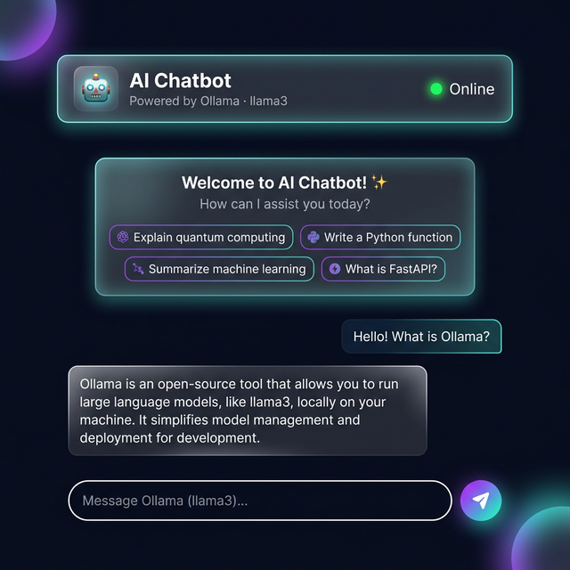

<div align="center">


<p align="center">
  <strong>An intermediate-level AI chatbot with real-time streaming, session memory, and a stunning browser UI — running entirely on your local machine.</strong>
</p>

<p align="center">
  
  
  
  
  
</p>

<br/>



<br/>

</div>

---

## ✨ Features

<table>
<tr>
<td width="50%">

### 🚀 Core
- ⚡ **Token-by-token streaming** via WebSockets
- 🧠 **Multi-turn memory** — context-aware per session
- 🔌 **REST + WebSocket** dual API
- ⚙️ **Fully configurable** via `.env`

</td>
<td width="50%">

### 💅 UI / UX
- 🌑 **Dark glassmorphism** design with gradient accents
- 💬 **Suggestion chips** for quick prompts
- 🔄 **Auto-reconnect** WebSocket with live status indicator
- 📋 **Markdown rendering** — bold, italic, code blocks

</td>
</tr>
</table>

---

## 🛠️ Tech Stack

| Layer | Technology | Role |
|---|---|---|
| 🏗️ Framework | **FastAPI** | Async HTTP + WebSocket server |
| 🤖 LLM Backend | **Ollama** | Local model inference (llama3, mistral…) |
| ⚡ Server | **Uvicorn** | ASGI server with hot-reload |
| 🌐 HTTP Client | **httpx** | Async requests to Ollama |
| ✅ Validation | **Pydantic v2** | Type-safe data models |
| 💡 Frontend | **Vanilla HTML/CSS/JS** | Zero-dependency browser UI |

---

## 🚀 Getting Started

### Prerequisites
- 🐍 Python **3.10+**
- 🦙 [Ollama](https://ollama.com) installed and running locally
- Pull a model: `ollama pull llama3`

### Quick Start

```bash
# 1. Clone the repository
git clone https://github.com/YOUR_USERNAME/fastapi-ollama-chatbot.git
cd fastapi-ollama-chatbot

# 2. Create & activate virtual environment
python -m venv venv
venv\Scripts\activate        # Windows
# source venv/bin/activate   # Mac / Linux

# 3. Install dependencies
pip install -r requirements.txt

# 4. Configure environment
copy .env.example .env       # Windows
# cp .env.example .env       # Mac / Linux

# 5. Start the server 🎉
uvicorn app.main:app --reload
```

> 🌐 Open **[http://localhost:8000](http://localhost:8000)** in your browser

---

## 🔌 API Reference

| Method | Endpoint | Description |
|---|---|---|
| `GET` | `/` | Redirects to the chat UI |
| `GET` | `/health` | Server health check |
| `POST` | `/chat` | Non-streaming chat (REST) |
| `WS` | `/ws/chat/{session_id}` | **Streaming WebSocket chat** |
| `GET` | `/history/{session_id}` | Retrieve conversation history |
| `DELETE` | `/history/{session_id}` | Clear conversation history |

### WebSocket Usage Example

```javascript
const ws = new WebSocket("ws://localhost:8000/ws/chat/my-session");

ws.onmessage = (event) => {
  if (event.data === "[DONE]") console.log("Stream finished");
  else process.stdout.write(event.data); // stream tokens
};

ws.send("Tell me about FastAPI");
```

---

## ⚙️ Configuration

Edit your `.env` file to customize the bot's behavior:

| Variable | Default | Description |
|---|---|---|
| `OLLAMA_BASE_URL` | `http://localhost:11434` | Ollama server URL |
| `OLLAMA_MODEL` | `llama3` | Model to use for inference |
| `SYSTEM_PROMPT` | `You are a helpful AI...` | System persona for the bot |
| `MAX_HISTORY` | `20` | Max messages remembered per session |

---

## 📁 Project Structure

```
fastapi-chatbot/
├── app/
│   ├── main.py                  # 🚀 App entry point & route registration
│   ├── config.py                # ⚙️  Settings loaded from .env
│   ├── models/
│   │   └── schemas.py           # 📐 Pydantic request/response models
│   ├── routes/
│   │   ├── chat.py              # 💬 Chat & WebSocket endpoints
│   │   └── health.py            # 🩺 Health check endpoint
│   └── services/
│       ├── llm_service.py       # 🤖 Ollama API integration & streaming
│       └── memory_service.py    # 🧠 Per-session conversation memory
├── static/
│   └── index.html               # 🌐 Browser chat UI (zero dependencies)
├── .env.example                 # 🔐 Environment variable template
├── requirements.txt             # 📦 Python dependencies
└── README.md
```

---

## 🤝 Contributing

Contributions, issues, and feature requests are welcome! Feel free to open a [pull request](../../pulls) or file an [issue](../../issues).

---

<div align="center">

**Made with ❤️ using FastAPI + Ollama**


</div>
